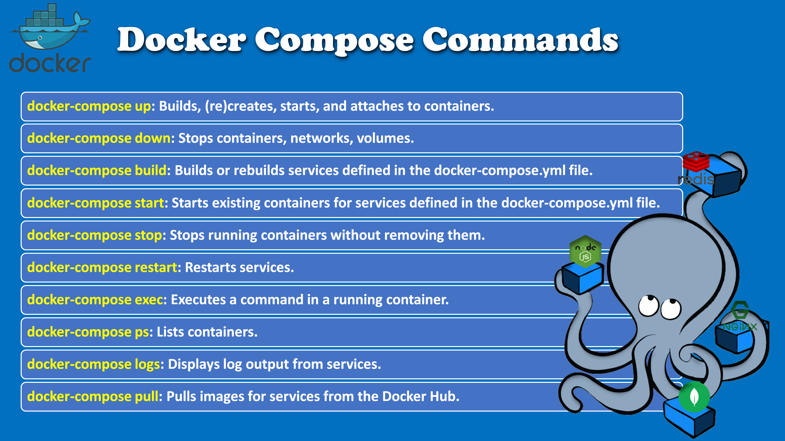

# What is Docker Compose?
* Docker Compose is a tool for defining and running multi-container in a Docker applications.
* It uses YAML files to configure the application's services and then build and starts all the services from the configuration file with a single command.
* It also configure n/w to communicate other container and configure  volume to make data shared and persist.

<br><br><br><br><br><br><br><br><br><br><br><br><br><br><br><br><br><br><br><br><br>

# Docker Compose Installation:
```
docker-compose --version
```
https://docs.docker.com/compose/install/linux/#install-the-plugin-manually

<br><br><br><br><br><br><br><br><br><br><br><br><br><br><br><br><br><br><br><br><br>

# Writing docker-compose.yaml file - defining services , n/w and volume 
# Running multiple Apps
```
services:
  node-app:
      image: node-app:latest
      build:
        context: ./node-app-ec2
        target: debug
      container_name: node-app
      ports:
        - "8080:8080"
        - "9229:9229"
      restart: always
      depends_on:
        - mongodb
      networks:
        - default

    mongodb:
      image: mongo:latest
      container_name: mongodb
      hostname: mongodb
      ports:
        - 27017:27017
      volumes:
        - mongodb_data:/data/db
      networks:
        - default

    mongo-express:
      image: mongo-express
      container_name: mongo-express
      ports:
        - "8082:8081"
      environment:
        ME_CONFIG_MONGODB_SERVER: mongodb
        ME_CONFIG_MONGODB_PORT: 27017
      depends_on:
        - mongodb
      networks:
        - default
    
    redis:
      image: redis
      hostname: redis
      container_name: redis
      restart: always
      ports:
        - '6379:6379'
      volumes:
        - redis_data:/data
      networks:
        - default

    redis-commander:
      image: rediscommander/redis-commander:latest
      container_name: redis-commander
      restart: always
      environment:
      - REDIS_HOSTS=host.docker.internal:redis:6379
      ports:
      - 8081:8081
      networks:
        - default

volumes:
  mongodb_data:
  redis_data:

networks:
  default:

```

<br><br><br><br><br><br><br><br><br><br><br><br><br><br><br><br><br><br><br><br><br>
# Node Api Configuration - Server.js file
```
const express = require("express");
const mongoose = require("mongoose");
const Redis = require("ioredis");
const User = require("./models/user"); // Import the User model

var cors = require('cors');

// use it before all route definitions


const uri = "mongodb://host.docker.internal:27017/userDB?ssl=false";
const PORT = process.env.PORT || 3000;

const app = express();
// middleware
app.use(express.json());
app.use(cors({origin: 'http://localhost:4200'}));

// host.docker.internal
const dbName = "userDB";
const redis = new Redis({
  host: "host.docker.internal", // Replace with your Redis server host
  port: 6379, // Default Redis port
  // password: "your_redis_password", // Replace with your Redis password, if any
});

redis.on("connect", () => {
  console.log("Connected to Redis successfully!");
});

mongoose
  .connect(uri)
  .then(() => {
    console.log("Database connected successfully!");
  })
  .catch((err) => console.log(err));

app.get("/", (req, res) => {
  res.send(`A simple node js applicion running on EC2 VM.`);
});
app.get("/contact", (req, res) => {
  res.send(`please contact Kumar Programming @kyprogramming`);
});

app.get("/save-data", (req, res) => {
  const newUser = new User({
    name: "John Doe",
    email: "john@example.com",
    age: 30,
  });

  newUser
    .save()
    .then((savedUser) => {
      console.log("User saved:", savedUser);
      res.send(200,`User Saved - ${JSON.stringify(savedUser)}`);
    })
    .catch((error) => {
      console.error("Error saving user:", error);
    });
});

app.get("/get-data", async (req, res) => {
  try {
    const items = await User.find();
    res.json(items);
} catch (err) {
    console.error(err);
    res.status(500).json({ message: 'Server error' });
}
});


app.get("/redis-save", (req, res) => {
  redis
    .set("myKey", "myValue")
    .then(() => {
      console.log("Redis Value set successfully Updated");
      res.send(200,`Redis Value set successfully Updated for Key - myKey`);
    })
    .catch((err) => {
      console.error("Error setting value:", err);
    });
});

app.get("/redis-get", (req, res) => {
  redis
    .get("myKey")
    .then((value) => {
      console.log("Value retrieved:", value);
      res.send(200,JSON.stringify(value));
    })
    .catch((err) => {
      console.error("Error retrieving value:", err);
    });
});

app.listen(PORT, () => {
  console.log(`Server started at port ${PORT}`);
});

```

<br><br><br><br><br><br><br><br><br><br><br><br><br><br><br><br><br><br><br><br><br>
# Models -  user.js file
```
const mongoose = require('mongoose');

// Define schema
const userSchema = new mongoose.Schema({
  name: String,
  email: String,
  age: Number,
});

// Create model
const User = mongoose.model('User', userSchema);

module.exports = User; // Export the model

```

<br><br><br><br><br><br><br><br><br><br><br><br><br><br><br><br><br><br><br><br><br>
# Docker compose commands


<br><br><br><br><br><br><br><br><br><br><br><br><br><br><br><br><br><br><br><br><br>
# Debugging Container
  ## launch.json
```
{
    "version": "0.2.0",
    "configurations": [
        {
            "name": "Docker: Attach to node",
            "type": "node",
            "request": "attach",
            "remoteRoot": "/usr/src/app",
            "port": 9229,
            "address": "localhost",
            "localRoot": "${workspaceFolder}/node-app-ec2/src",
            "restart": true
        }
    ]
}
```
  ## Dockerfile
```
# Use a lightweight web server image , alpine - smallest in size and performance oriented
FROM node:alpine as debug

# Set the working directory inside the container
WORKDIR /usr/src/app

# Copy the HTML, CSS, and JavaScript files into the container
COPY . /usr/src/app

# install dependencies inside the container
RUN npm install 
RUN npm install -g nodemon --save

# Expose port 4200 to the outside world
EXPOSE 8080

ENTRYPOINT ["nodemon","--inspect=0.0.0.0","src/server.js" ]

```

